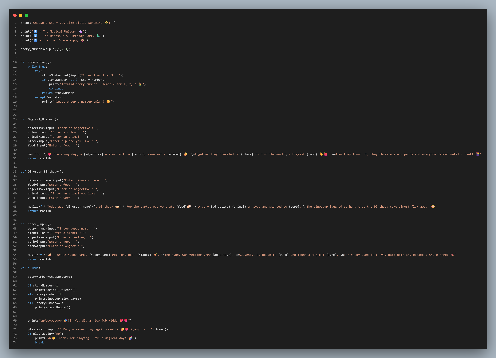

# 🦄 Mad Libs Story Generator

A fun Python Mad Libs game where kids can choose from three different stories and create their own adventures by entering words!

## 🌟 Features
- 🦄 The Magical Unicorn
- 🦕 The Dinosaur's Birthday Party
- 🐶 The Lost Space Puppy
- Input validation to ensure a valid story choice
- Interactive user experience
- Beginner-friendly Python project

## 🛠️ Built With
- Python 3
- Functions
- Loops
- Conditional Statements (if, elif, else)
- String Formatting (f-strings)

## 🎮 Example
Choose a story you like little sunshine 🌻

1️⃣ - The Magical Unicorn 🦄
2️⃣ - The Dinosaur's Birthday Party 🦕
3️⃣ - The Lost Space Puppy 🐶

Enter 1️⃣ or 2️⃣ or 3️⃣ : 1

## 📚 What I Learned
- Working with user input
- Creating and calling functions
- Using loops for input validation
- Writing interactive console applications
- Organizing Python code into reusable components

## Author
D.B.Sehansa Dewlini