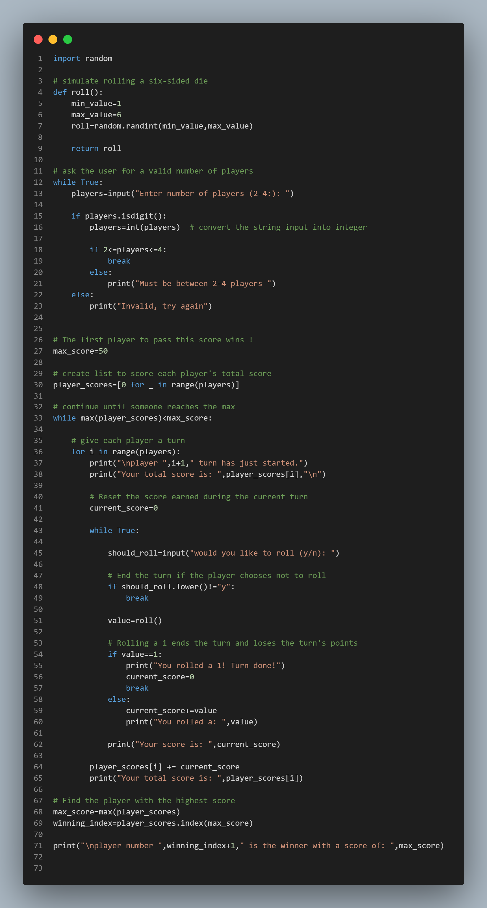

# 🎲 Pig Game (Python)

A simple command-line implementation of the classic Pig Dice Game built with Python. This project was created to practice Python fundamentals such as loops, functions, lists, user input validation, and the random module.

## 📖 About the Game

Pig is a turn-based dice game where players compete to be the first to reach 50 points.

Rules
- The game supports 2 to 4 players.
- On each turn, a player can choose to:
- Roll the die.
- Hold (stop rolling) and keep the points earned during that turn.
- Every roll between 2 and 6 adds to the player's current turn score.
- Rolling a 1 causes the player to lose all points earned during that turn, and the turn immediately ends.
- The first player to reach 50 points wins the game.

## ✨ Features
- 🎲 Random dice rolling using Python's random module
- 👥 Supports 2–4 players
- ✅ Input validation for the number of players
- 🔄 Turn-based gameplay
- 📊 Tracks each player's total score
- 🏆 Automatically announces the winner

# 🛠️ Technologies Used
- Python 3
- Built-in random module

# 📚 Concepts Practiced
- Functions
- Loops (while and for)
- Conditional statements
- Lists
- Input validation
- Random number generation
- Game logic
- Variables and operators

# 📸 Demo

# 👩‍💻 Author
Created by Diyagu/Python🐍 as part of my Python learning journey and GitHub portfolio.

If you found this project interesting, feel free to ⭐ the repository!

  

